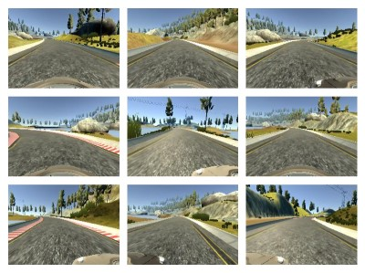
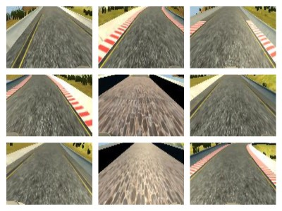
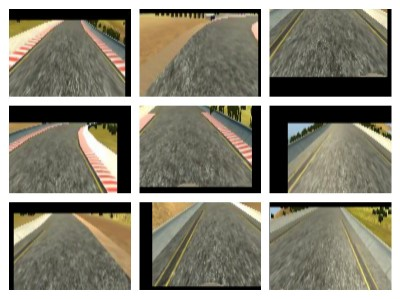
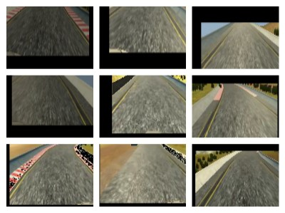

## **Project 3: Behavioral Cloning**

### **Deriving and Designing a Model Architecture**
The initial approach I took was to start with a small set of images and a simpler network architecture in order to get the car to drive autonomously which quickly allowed me to understand how the pipeline from the model to the simulator worked.
Once I had a rudimentary understanding of the pipeline I moved on to a tried and tested architecture (NVIDIA) and then proceeded to successively test with different hyper parameters.
Because I was using Udacity's provided data I didn't have to worry about recording any new data I was able to focus on developing the augmentation operations.

### **Model Architecture Details**

#### Type of model used
I based my **convolutional neural network** model on the [NVIDIA Autopilot paper.](http://images.nvidia.com/content/tegra/automotive/images/2016/solutions/pdf/end-to-end-dl-using-px.pdf)

#### Number of layers
My model has **10 layers** (1 more than the NVIDIA model) including a **normalization** layer, a **color space transformation** layer, **5 convolutional** layers and **3 fully connected** layers. I used **ELU** (Exponential Linear Unit) for activation functions to keep the steering output smooth. I did not use any dropout layers as the NVIDIA model is already very trim and dropouts decreased driving performance a lot.

#### Size of each layer
 - The normalization layer is a hard-coded Lambda layer and normalizes data to **-0.5 to 0.5** range.
 - The color space transformation layer is a convolutional layer with **3 1x1 filters**. This allows the model to choose its best color space.
 - The subsequent 3 convolutional layers have a **2x2 stride** and **5x5 filters** with the following sizes: **3, 24, 36**.
 - The subsequent 2 convolutional layers have a **1x1 stride** and **3x3 filters** with the following sizes: **48, 64**.
 - The fully connected layers are of size **100, 50 and 10**.

### **Dataset Creation, Model Training and Dataset Characteristics**

#### Dataset creation
After a few time consuming and not very effective attempts at creating my own dataset by driving around the track and recording normal driving and "recovery" driving I decided to **use the dataset provided by Udacity** [here.](https://d17h27t6h515a5.cloudfront.net/topher/2016/December/584f6edd_data/data.zip)

#### Dataset characteristics
The Udacity dataset is comprised of a total of **24,108** images (8,036 images for each of the 3 cameras: center, left and right) at about **307 MB** of data uncompressed. Each image is **320 pixels wide** and **160 pixels tall** and stored in **RGB format**.

#### Dataset augmentation
In order to reduce overfitting, which manifests as a high left turn bias on this project, I utilized data augmentation which is the process of creating new data from an existing dataset by performing some of the following operations:
- **Removing some** of the **lower steering angles** (to reduce the tendency to drive straight.)
- Using the **left and right camera images** with a small compensation to the steering angle, to improve recovery.


- **Cutting off the sky and the hood** parts of the image, to allow the algorithm to focus on the essential parts of the image.


- **Translating** the images vertically (to improve recovery) and horizontally (to simulate hills.)


- **Scaling the brightness** of the image (to simulate shadows and driving through different light conditions.)


- **Flipping** the images horizontally (to reduce the left turn bias.)

#### Model training process
The model was trained using an **Adam optimizer** minimizing the Mean Squared Error (**MSE**.) A **Python generator** was used to process the images in batches and to augment the images as necessary. The images were split into a **training and validation set** (25% validation) before passing them to the generator.
A total of **5 epochs**, **19,803 samples per epoch** and a **batch size of 287** were used as parameters to the generator:
- Training more than 5 epochs did not result in major reductions to MSE or driving accuracy. I tested with 8, 32, 100 and 200 epochs.
- The samples per epoch size was chosen on purpose as a large number to ensure that enough variety of samples are used on each epoch to properly train the model and also to be an exact multiple of the batch size which was chosen because it is a common divisor of both the training data size (6027) and the validation data size (2009). Please note that due to some low steering angles being randomly removed most batches are not exactly of batch size.

#### Testing the network generated
Follow these instructions (requires a good video card like a GeForce GTX 1060 or above)
1. Run the automation server: `python drive.py model.h5`
2. Open the simulation client, run `Default Windows desktop 64-bit.exe`
3. Choose graphics options (e.g. 1600 x 1200, Fantastic), press `Play!`
4. Click on `Autonomous Mode`
5. Enjoy the ride!

#### Test video of model generated
[](http://www.youtube.com/watch?v=zTKNbQekGaM "test video of model generated")

### **References**
- NVIDIA's Autopilot (http://images.nvidia.com/content/tegra/automotive/images/2016/solutions/pdf/end-to-end-dl-using-px.pdf)
- Comma.ai steering model (https://github.com/commaai/research/blob/master/train_steering_model.py)
- Python generators (https://blog.keras.io/building-powerful-image-classification-models-using-very-little-data.html)
- ReLU vs ELU (http://www.picalike.com/blog/2015/11/28/relu-was-yesterday-tomorrow-comes-elu/)
- Vivek Yadav's blog (https://chatbotslife.com/using-augmentation-to-mimic-human-driving-496b569760a9#.izzv2lrj4)

```python

```
